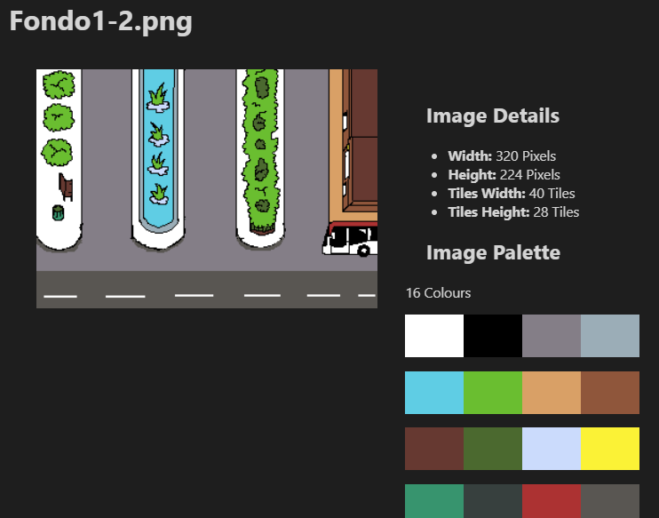
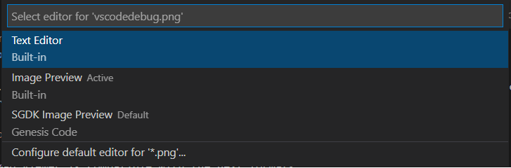

# Bitmap Viewer

Since 1.3.3 version, you can see the Custom Image Viewer; with this editor, you can see some Image Information like width, height, tiles or colour palette.

In this editor you can see:

* Image file name.
* Image Preview.
* Image width in pixels.
* Image height in pixels.
* Image width in tiles (8x8).
* Image height in tiles (8x8).
* Image Palette

The bitmap Viewer is compatible with the next image formats:

* BMP
* PNG
* JPEG
* JPG

To open a Image with this editor, rigth click in the tab titble and select the option of _Reopen Editor With..._, and select _SGDK Image Preview_.

