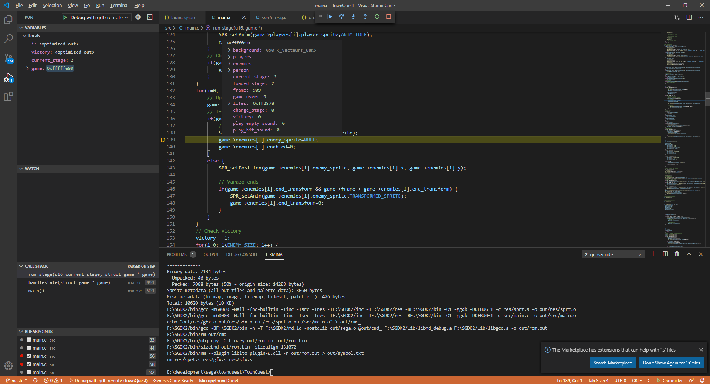

# Debugging Options

Genesis code, can help you to create a configuration for remote debugging with GDB. With this configuration you can use an emulator like GensKMod or Blastem for open a remote debug session using GDB. 

When you create a new Project Genesis code, adds a folder called ```.vscode``` that contains all the configuration of your project. Now Genesis code create a ```launch.json``` file with the minimum configuration for open a remote debuging session.

**NOTE**: This file depends of your Operating System and the Toolchain selected on the Genesis code Settings (SGDK/GENDEV or MARSDEV).

**REMEMBER**: Before open a debug session you need to call the Genesis Code: Compile with Debug Options command.

Lets see one example of the _launch.json_ file:

```json
  {
    "version": "0.2.0",
    "configurations": [    
      {
          "name": "Debug with gdb remote",
          "request": "launch",
          "type": "cppdbg",
          "program": "${workspaceRoot}\\out\\rom.out",
          "miDebuggerServerAddress": "localhost:6868",
          "sourceFileMap": {
              "d:\\apps\\sgdk\\src\\": "${env:GDK}\\src\\",
          },
          "args": [],
          "stopAtEntry": true,
          "cwd": "${workspaceFolder}",
          "environment": [],
          "externalConsole": false,
          "MIMode": "gdb",
          "launchCompleteCommand": "exec-continue",
          "miDebuggerPath": "${env:GDK}\\bin\\gdb.exe",
          "setupCommands": [
              {
                  "text": "set directories '${workspaceFolder};$cwd;$cdir'"
              }
          ],
      }
  ]
}
```
**NOTE:** This json file corresponds to the Windows SGDK version.

Lets see some properties of this file:

* **program**: The program that need to be used with GDB; this is one of the files created when you compile with debug options; contains information about the Symbols table.
* **miDebuggerServerAddress**: Address and port used for connect with the emulator. Change the port when you use GensKMod or Blastem. This is only used on Windows System.
* **sourceFileMap**: The libmd used in SGDK, contains the statics source file paths; so you need to reconfigure them for your SGDK instalation folder.
* **miDebuggerPath**: This is the path of your GDB executable.

**NOTE**: Some versions of Blastem, can crash when is used with vscode debugging session; this is a unimplemented features in Blastem for the GDB protocol.

If you need more information about how to debug with VSCODE, please see [VSCODE Debug Configuration page](https://code.visualstudio.com/docs/cpp/cpp-debug). Also, you can see more information in the [GDB web page](https://www.gnu.org/software/gdb/).


