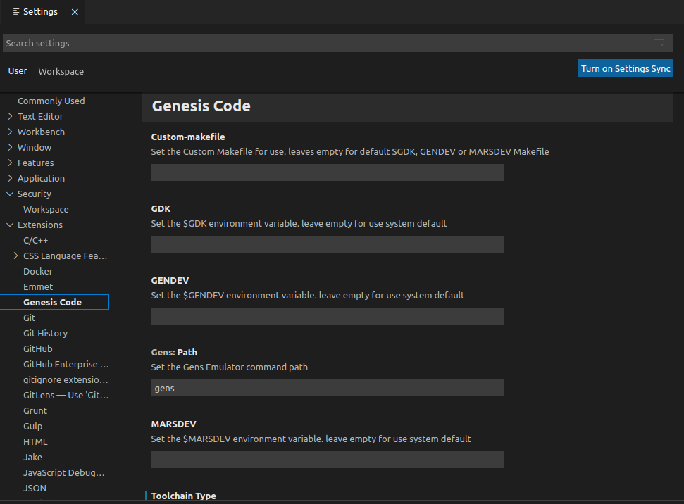
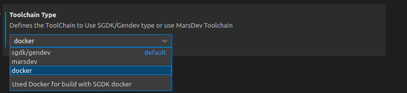
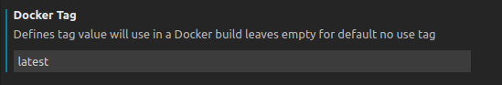
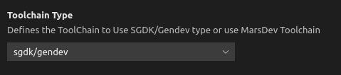
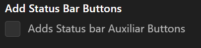

# Installation

 You can find Genesis Code in the [Microsoft Marketplace for Extensions](https://marketplace.visualstudio.com/items?itemName=zerasul.genesis-code); when you find the extension click on install via web or via visual studio code.

 You also, can install via our release tags on the [Github Repository](https://github.com/zerasul/genesis-code) of Genesis Code and install using [visual studio code Extension Instalation Command](https://vscode-docs.readthedocs.io/en/stable/extensions/install-extension/).

## Configuration

 To use Genesis code, you need to configure two important things.

 First, you need to install and configure your Genesis Development Kit; it can be SGDK or GENDEV projects.

 Its important to set the enviroment variable of GDK for SGDK projects, or GENDEV enviroment variable for GENDEV based project.

```bash
set %GDK%=f:/sgdk
```

```bash
export GENDEV=/opt/gendev
```


For more information you can see the repositories of [SGDK](https://github.com/Stephane-D/SGDK) or [GENDEV](https://github.com/kubilus1/gendev).

After configure the SGDK or GENDEV enviroment, we need to configure the Gens path command.

### Configure all settings for the extension

First of all you need to go a section to configure your Genesis Code extension.
This is located in Visual Studio Code following menu : File -> Prefernces -> Settings [Ctrl+,].
Go to Extensions -> Genesis Code, now you can start configuring as your preferences.



### Configuration with build using Docker (since v1.4.x)

Genesis Code is compatible build using docker. 
Previously you should be created a docker image, Genesis Code asume your are followed stepd in the [SGDK](https://github.com/Stephane-D/SGDK) repo.

If you want to build using docker, you should be select a toolchain Docker in the Genesis Code settings.



If you want to use docker adding a tag, you can set in the Docker Tag section.



If you want to use an alternative SGDK Docker Image like [Doragasu SGDK Docker Image](https://gitlab.com/doragasu/docker-sgdk), you can enable the check to active this feature, and don't forget to add the current Gitlab Registry Docker Tag.


### Configuration with MarsDev (since v1.2.0)

Genesis Code is compatible with [MarsDev](https://github.com/andwn/marsdev) toolchain. Only you need to do is install MarsDev and select the toolchain in the Genesis Code settings.



For more information with MarsDev toolchain, please go to [MarsDev Github Repo](https://github.com/andwn/marsdev).

### Configuration in MaCOs (since v1.1.0)(Deprecated)

To use SGDK and Genesis code in MacOs, you need to install and configure Wine for use with SGDK. Follow the next instructions for install and configure SGDK with Wine in MacOs.

1 . Install [brew](https://brew.sh/index) on your system.

2 . Create and configure the installation directory:

```bash
sudo mkdir /opt/gendev/
sudo chown $USER: /opt/gendev
```

3 . Set the next environment Variables.

```bash
export GENDEV=/opt/gendev
export GDK='c:/sgdk'
export GDK_WIN='c:\sgdk'
```

**NOTE**: Remember to put this variables into your bash_profile to make them permanent.

4 . Install the packages needed with _brew_.

```bash
brew cask install xquartz
brew install wine
```

5 . Configure wine

```bash
mkdir $GENDEV/wine
WINDEBUG=-all WINEARCH=win64 WINEPREFIX=$GENDEV/wine wineboot
```

6 . clone SGDK project using git.

```bash
cd $GENDEV
git clone https://github.com/Stephane-D/SGDK.git
ln -sv $GENDEV/SGDK $GENDEV/wine/drive_c sgdk
```

7 . For use Java with SGDK for the resource management you need to install Java in the wine system. First, you need to dowload the JDK (using oracle or openjdk); its important to download the x86 version (32 bits). Once downloaded we need to install it in wine.

```bash
cd <your folder where the jdk installer is downloaded>
WINEPREFIX=$GENDEV/wine wine64 cmd
```

```bash
z:\> jdk-8u221-windows-i586.exe /s
```

8 . Once java is instaled in wine, we need to configure the wine environment variables to add java to the Path variable.

```bash
WINEPREFIX=$GENDEV/wine wine regedit
```

This will open the register editor in wine; now we need to go the the next register path: ```HKEY_LOCAL_MACHINE\System\CurrentControlSet\Control\Session Manager\Environment```; and change the PATH variable adding the current windows java path.

9 . For last, we need to compile and build all the tools in SGDK.

```bash
WINEPREFIX=$GENDEV/wine wine64 cmd
%GDK_WIN%\bin\make -f %GDK_WIN%\makelin.gen
```

**NOTE:** thanks to the [https://github.com/v4ld3r5/sgdk_vscode_template.git](https://github.com/v4ld3r5/sgdk_vscode_template.git) project for this configuration.

**NOTE2:** You can see some errors due to MacOs 32bits limitations; check the MacOs Documentation for more information.

**WARNING**: THis is a deprecated configuration and will be changed in the future.

### Configure Terminal (Windows)

If you get an error using genesis code commands like:

```powershell
Cannot load'%GDK%' module. for more information, please run 'Import-Module %GDK%'.
```

**NOTE**: Since v1.5.1 of Genesis Code this Configuration is made when a new Project is created. No more extra configuration is needed.

This is because you are using PowerShell instead CMD Prompt; you can fix this in two ways:

* Run ```cmd``` command on gens-code terminal.
* Change default terminal, using the command ```>Terminal: Select default Profile``` and select Command Prompt (cmd).

### Configure Headers using Docker containers

If you are going to use Docker containers, the C headers don't work; this is due the SGDK headers are inside the Docker container and are not from outside the container (without adding a volume). To fix this, we need to change the project configuration and add the SGDK's headers path.

Follow the next steps to add the headers to vscode settings:

1. Download SGDK from the [release page](https://github.com/Stephane-D/SGDK/releases); don't worry about windows version.
2. Locate the _.vscode_ folder inside your project folder.
3. Edit the ```settings.json``` file with the following content:

```json
{ 
    "C_Cpp.default.includePath": ["{sgdkpath}/inc",
    "{sgdkpath}/res",
    "res",
    "inc"
]
}
```

**NOTE:** Change the ```{sgdkpath}``` to your SGDK's folder path.

### Gens Path Command Configuration

To use an Emulator like [Gens](http://gens.me/) you need to configure your gens path Command Configuration.

This configuration store you gens command to call the emulator and open the attached rom binary. In this case you can set it by tow ways.

The first way is using the Genesis Code Configuration. You can see the settings section in your visual studio instalation using the menu File->preferences->settings (or with the ctrl+, shortcut).


The second way is using the Set run path Command; this command allows you to put the Gens Emulator command in one Input Box. For more information, please see commands section.

**NOTE**: You can use other emulators like [Blastem](https://www.retrodev.com/blastem/).

### Add Status Bar auxiliary Buttons

You can add Auxiliary Buttons at the status bar for compile, compile for debugging, compile & run and clean the current project. Only check the current configuration and you can see the status bar auxiliary buttons at the current status bar.

