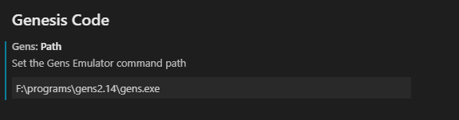

# Installation

 You can find Genesis Code in the Microsoft Marketplace for Extensions; when you find the extension click on install via web or via visual studio code.

 You also, can install via our release tags on the [Github Repository](https://github.com/zerasul/genesis-code) of Genesis Code and install using [visual studio code Extension Instalation Command](https://vscode-docs.readthedocs.io/en/stable/extensions/install-extension/).

## Configuration

 To use Genesis code, you need to configure two important things.

 First, you need to install and configure your Genesis Development Kit; it can be SGDK or GENDEV projects.

 Its important to set the enviroment variable of GDK for SGDK projects, or GENDEV enviroment variable for GENDEV based project.

```bash
set %GDK%=f:/sgdk
```

```bash
export GENDEV=/opt/gendev
```

For more information you can see the repositories of [SGDK](https://github.com/Stephane-D/SGDK) or [GENDEV](https://github.com/kubilus1/gendev).

After configure the SGDK or GENDEV enviroment, we need to configure the Gens path command.

### Gens Path Command Configuration

To use an Emulator like [Gens](http://gens.me/) you need to configure your gens path Command Configuration.

This configuration store you gens command to call the emulator and open the attached rom binary. In this case you can set it by tow ways.

The first way is using the Genesis Code Configuration. You can see the settings section in your visual studio instalation using the menu File->preferences->settings (or with the ctrl+, shortcut).



The second way is using the Set run path Command; this command allows you to put the Gens Emulator command in one Input Box. For more information, please see commands section.