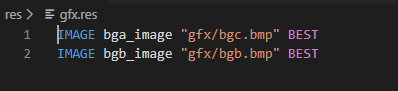
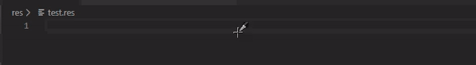

# Other Features

In this section, you can see another features related with genesis code.

## Syntax HighLigthing on Resource Files (Since v1.1.0).

With Genesis code, you can see syntax Hightligthing for the SGDK Resource Files. With this features you can see the keywords and some other important sections about the resource files for SGDK (for use the rescomp tool). You can see an example in the next image:

## SGDK Resource Code Autocompletion (Since v1.1.1)

With Genesis code, you can use contextual help (<kbd>ctrl</kbd>+<kbd>space</kbd>) for see the autocompletion help for the SGDK resource files.

## Use Custom Make File

You can use a custom Make File using the settings of the extension; you can define the path of your custom Makefile.

**NOTE**: In MacOs, you can't use custom makefile with the SGDK/GENDEV toolchain; this is due to the use of wine; we are working on a solution.

## Use custom Environment Variables

You can use custom Environment variables for the GDK, GENDEV or MARSDEV variables. you can define it in the Genesis code Settings.

**NOTE**: In MacOs, you can't use custom envvariables with the SGDK/GENDEV toolchain; this is due to the use of wine; we are working on a solution.