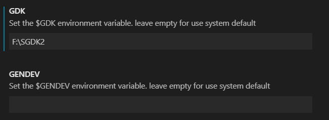
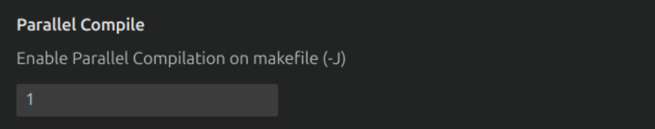

# Other Features

In this section, you can see another features related with genesis code.

## Syntax HighLigthing on Resource Files (Since v1.1.0)

With Genesis code, you can see syntax Hightligthing for the SGDK Resource Files. With this features you can see the keywords and some other important sections about the resource files for SGDK (for use the rescomp tool). You can see an example in the next image:


## SGDK Resource Code Autocompletion (Since v1.1.1)

With Genesis code, you can use contextual help (<kbd>ctrl</kbd>+<kbd>space</kbd>) for see the autocompletion help for the SGDK resource files.


## Use Custom Make File

You can use a custom Make File using the settings of the extension; you can define the path of your custom Makefile.


**NOTE**: In MacOs, you can't use custom makefile with the SGDK/GENDEV toolchain; this is due to the use of wine; we are working on a solution.

## Use custom Environment Variables

You can use custom Environment variables for the GDK, GENDEV or MARSDEV variables. you can define it in the Genesis code Settings.



**NOTE**: In MacOs, you can't use custom envvariables with the SGDK/GENDEV toolchain; this is due to the use of wine; we are working on a solution.

## Parallel Compilation (since 1.5.2)

The new parameter configuration (```parallel compilation```); this parameter allows to use extra threads when the build or compilation script is launched. This option adds the -j flag when call to make. This flag will speedup the compilation time.

By default this parameter is ```1```.

**NOTE:** The recomend flag is ```-j4```.



## Extra parameters (since 1.5.2)

This new configuration parameter, allow to add extra parameters to the compilation script (make); this parameter is added before the current goals when the make executable is called.

By default, this prameter is empty.


## Status Bar Auxiliary Buttons (Since 1.5.0)

If you enable the auxiliary Bar buttons on configuration, you can see them at the status bar (bottom part of the editor).


Pushing in each button enable one of the commonly used commands of Genesis Code.

* **Debug**: Compile for Debugging.
* **Play**: Compile & Run.
* **Build**: Compile.
* **Clean**: Clean.

Remember that you can enable or disable theses buttons in the Genesis Code configuration.