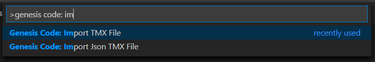

# Importing TMX Files

With genesis code, you can use TMX files for generate a header C File with the information of your maps. You can use TMX file format or TMX json format for generate the header C file. For more info about the TMX file format, please see [Map Editor Tiled Web page](https://www.mapeditor.org/).

To generate a header C file, only you have to do is execute the _Genesis Code: import TMX file_ for generate from TMX format file or execute the _Genesis Code: Import TMX json File_ for generate from the Json TMX Format.

After select the TMX/ TMX json file Format, you can see in the _res_ folder the header file with the Map information.
